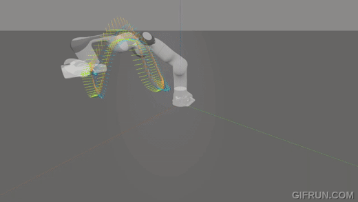
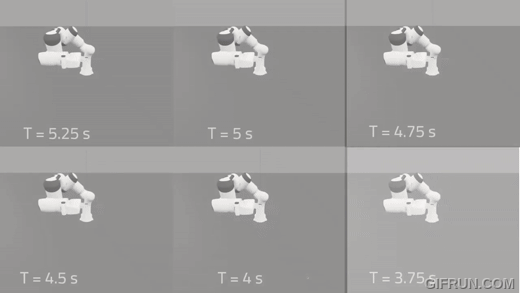

# GSFT: Geometric Slosh-Free Tracking for Robotic Manipulators

A real-time slosh-free tracking method for robotic manipulators.

|                                      |                                      |
| :----------------------------------: | :----------------------------------: |
|  |  |

<p align="center">
  
</p>

<!--  -->

For the implementation details, please check the [paper](https://arxiv.org/pdf/2402.05197.pdf) and/or watch the [video](https://youtu.be/4kitqYVS9n8). If you use this framework please cite our work:

```
@misc{arrizabalaga2024geometric,
      title={Geometric Slosh-Free Tracking for Robotic Manipulators},
      author={Jon Arrizabalaga and Lukas Pries and Riddhiman Laha and Runkang Li and Sami Haddadin and Markus Ryll},
      year={2024},
      eprint={2402.05197},
      archivePrefix={arXiv},
      primaryClass={cs.RO}
}
```

## Installation

### Dependencies

Initialize git submodules with

```
    git submodule init
    git submodule update
```

### Python environment

Install the specific versions of every package from `requirements.txt` in a new conda environment:

```
conda create --name gsft python=3.9
conda activate gsft
pip install -r requirements.txt
```

To ensure that Python paths are properly defined, update the `~/.bashrc` by adding the following lines

```
export GSFT_PATH=/path_to_gsfc
export PYTHONPATH=$PYTHONPATH:/$GSFT_PATH
```

## Usage

To run an example, execute [this file](main.py). For example,

```
python main.py --t_nav 6.5 --case h
```

runs the `helix` case study for a navigation time of `6.5 s`. The other two case studies are `b` (backflip, named "loop" in the paper) or `l` (lissajous). You can also add the `--no_visualization` and `--nsf` (non slosh-free) flags when running the command. Other seettings can be modified from the [configuration file](config.py)
